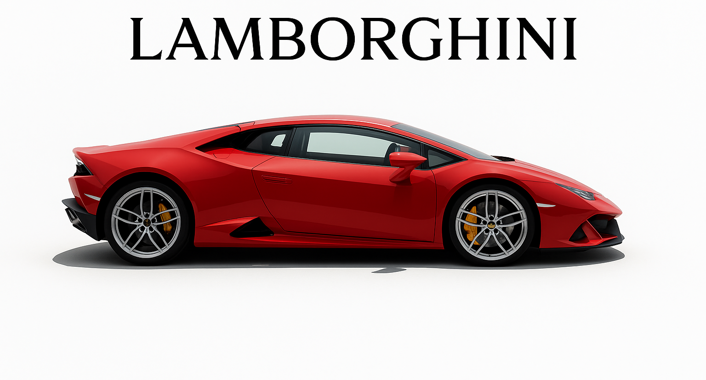
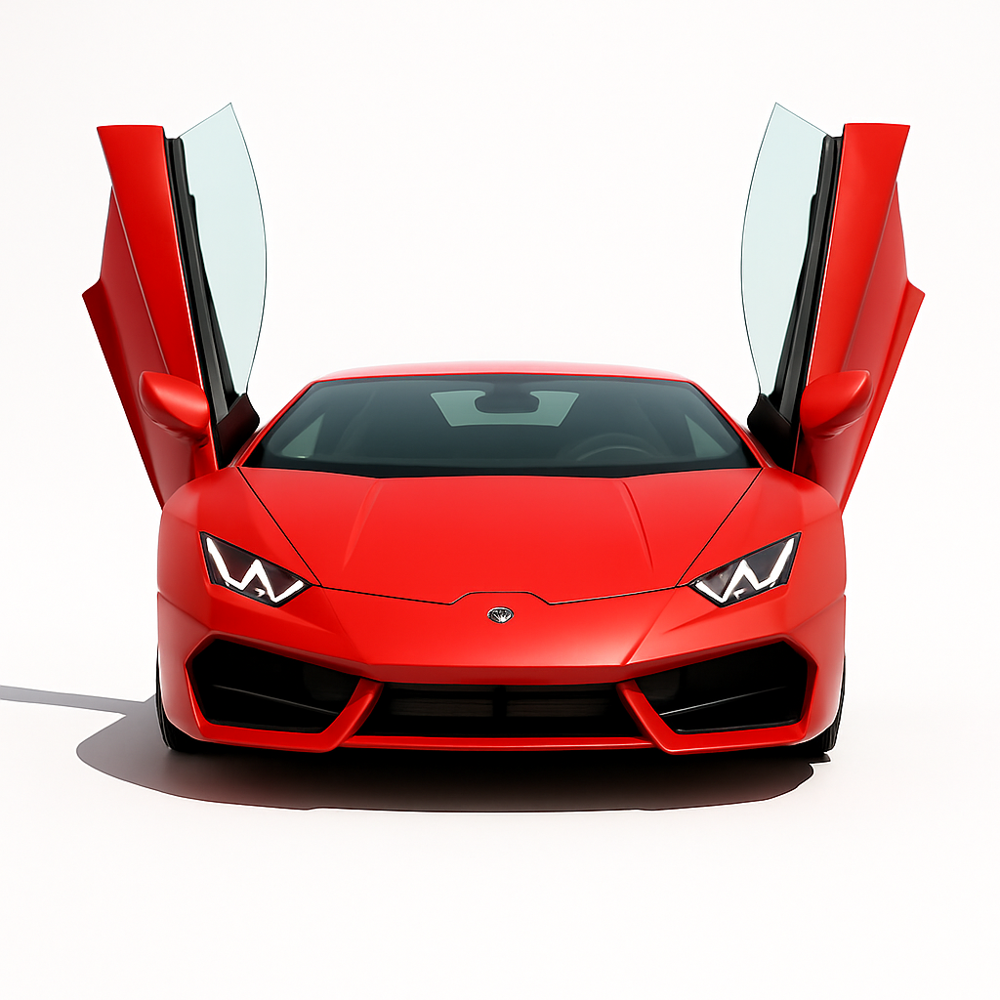
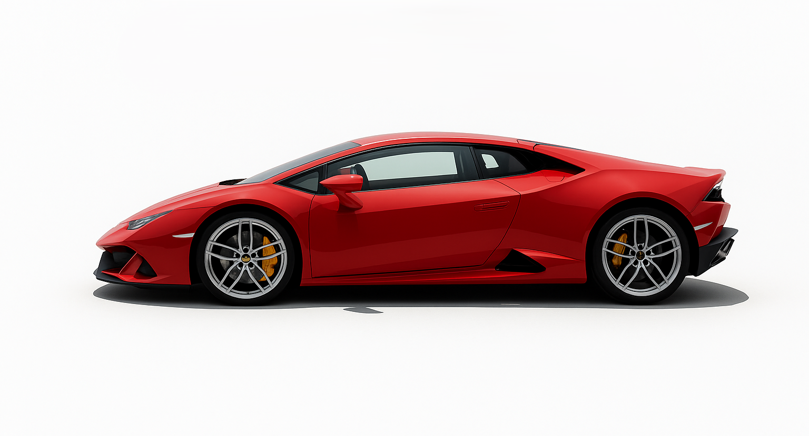
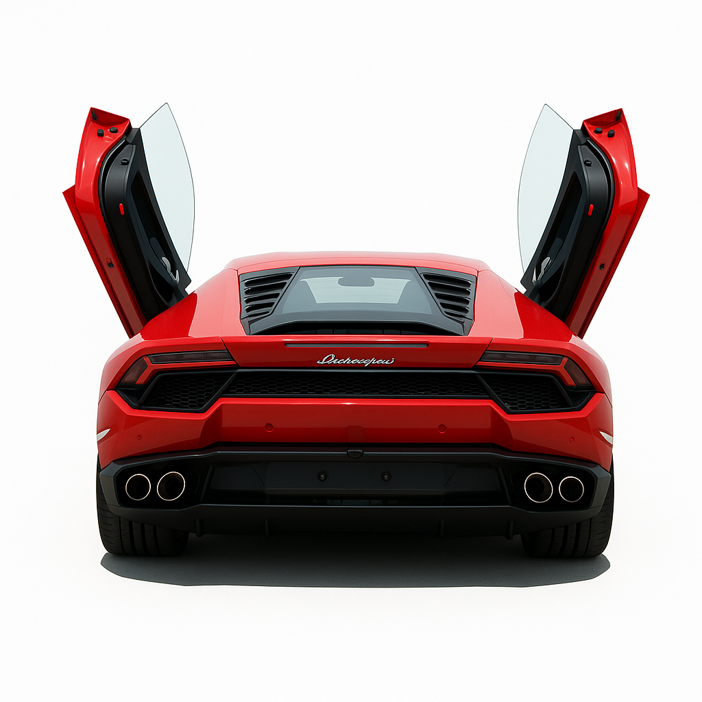

# 🏎️ Lamborghini Car Customizer

Welcome to the **Lamborghini Car Customizer**! This project is a visually rich, interactive web app that lets users view and customize a Lamborghini car in different colors and perspectives.

---

## 🚀 Features

| Feature                | Description                                                                 |
|------------------------|-----------------------------------------------------------------------------|
| 🎨 Color Selection     | Choose from 6 vibrant Lamborghini colors using interactive color dots.        |
| 🔄 360° Car Views      | Switch between side, front, left, and back views of the car.                 |
| 🖼️ Smooth Transitions | Animated transitions for car views and color changes.                        |
| 🧭 Animated Navigation | Modern, animated navigation bar for seamless browsing.                       |
| 📱 Responsive Design   | Looks great on all devices, from mobile to desktop.                          |

---

## 📸 Screenshots

| Side View | Front View | Left View | Back View |
|-----------|------------|-----------|-----------|
|  |  |  |  |

---

## 🛠️ Tech Stack

- **Next.js** (React framework)
- **Tailwind CSS** (utility-first CSS)
- **TypeScript** (type safety)
- **Modern UI Components**

---

## 📂 Project Structure

```text
lamborghini/
├── app/
│   ├── globals.css
│   ├── layout.tsx
│   └── page.tsx
├── components/
│   ├── theme-provider.tsx
│   └── ui/
├── public/
│   └── images/
├── styles/
├── hooks/
├── lib/
├── ...
```

---

## 🚦 Getting Started

1. **Install dependencies:**
   ```bash
   pnpm install
   # or
   npm install
   ```
2. **Run the development server:**
   ```bash
   pnpm dev
   # or
   npm run dev
   ```
3. **Open your browser:**
   Visit [http://localhost:3000](http://localhost:3000)

---

## 🎨 Customization

- **Change Car Colors:** Click the color dots on the left/right of the car.
- **Switch Views:** Use the arrow buttons to rotate the car view.

---

## 🙏 Credits

- Lamborghini images: © Lamborghini (for demo purposes)
- UI inspired by modern automotive websites
- Built with ❤️ by [Your Name]

---

## 📄 License

This project is for educational/demo purposes only. Not affiliated with Lamborghini S.p.A. 